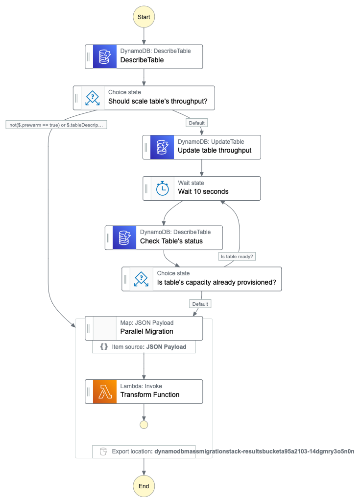

# Massively parallel migrations in DynamoDB



Thanks to recent accouncement of [Step Functions Distributed Map](https://aws.amazon.com/blogs/aws/step-functions-distributed-map-a-serverless-solution-for-large-scale-parallel-data-processing/), we can now run 10,000 of parallel executions in Step Functions. This is especially useful for transforming/migrating big datasets in DynamoDB.

This repo contains a sample [AWS CDK](https://docs.aws.amazon.com/cdk/v2/guide/home.html) code for performing such a migration.

Because AWS CDK does not support Step Functions Distributed Map yet, we need to use ASL definition directly. This is a bit tricky, but not too hard.

## How to use

1. Clone project, install dependencies

```bash
git clone https://github.com/dynobase/dynamodb-mass-migration
cd dynamodb-mass-migration
npm i
```

2. Go to `lib/migrationFunction.ts` and adjust your migration logic inside `transformFn`. By default, it just adds `updatedAt` attribute to each item.

3. Deploy the stack:

```bash
AWS_PROFILE=your-profile \
AWS_REGION=us-east-1 \
npx cdk deploy --require-approval never
```

4. After deploying, invoke the migrating state machine:

> **Important IAM note:** Make sure that State Machine and Transform Function have proper IAM permissions to access and manipulate DynamoDB table.

```bash
SFN_ARN=<arn-of-the-deployed-state-machine> \
TABLE_NAME=<name-of-the-table-to-migrate> \
TOTAL_SEGMENTS=100 \ # number of segments to split the table, should be less than 10,000
npx ts-node bin/run.ts
```

This will start the state machine with following payload:

```json
{
  "prewarm": false,
  "map": [
    {
      "tableName": "<name-of-the-table-to-migrate>",
      "totalSegments": "100",
      "segment": "0" // Or 1, 2, ..., 99
    } // ... 99 more items
  ]
}
```

### Table pre-warming

DynamoDB tables with On-demand mode can handle up to 2,000 WCU and 6,000 RCU, or spikes up to 200% of its previous high-water mark.

If table is in provisioned mode and your migration is expected to consume more, this project has a feature to [pre-warm the table before starting the migration](https://aws.amazon.com/blogs/database/running-spiky-workloads-and-optimizing-costs-by-more-than-90-using-amazon-dynamodb-on-demand-capacity-mode/).

By providing `PREWARM=true`, it will set your table's RCU to 4,000 (customizable via `PREWARM_WCU` env var) and RCU to 12,000 (customizable via `PREWARM_RCU` env var).

If you don't need to pre-warm the table, you can pass `PREWARM=false` to the `run.ts` script or simply skip this setting.

**Todo:** add a feature to automatically set the table back to its original capacity after the migration.

## Useful links:

- https://theburningmonk.com/2019/03/understanding-the-scaling-behaviour-of-dynamodb-ondemand-tables/
- https://docs.aws.amazon.com/amazondynamodb/latest/developerguide/HowItWorks.ReadWriteCapacityMode.html#HowItWorks.InitialThroughput
- https://aws.amazon.com/blogs/database/running-spiky-workloads-and-optimizing-costs-by-more-than-90-using-amazon-dynamodb-on-demand-capacity-mode/
